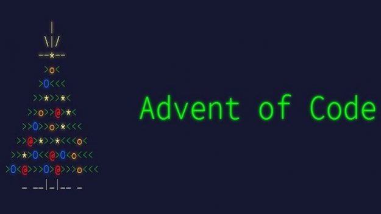

# Overview

My solutions written in [Golang](http://golang.org) for [Advent of Code 2019](https://adventofcode.com/2019).
Note that this code is **hacky, not polished or refactored in any way** and its sole purpose it to solve the puzzles.
After I have the correct solution, I leave the source code as it is, ... to clean it up ... someday ;-).

| Day | Problem                             | Solution | Topic |
|-----|-------------------------------------|----------|-------|
| 1   | [The Tyranny of the Rocket Equation](https://adventofcode.com/2019/day/1) | [1](1) | Recursive computations |
| 2   | [1202 Program Alarm](https://adventofcode.com/2019/day/2) | [2](2) | Implement basic self-modifying CPU |
| 3   | [Crossed Wires](https://adventofcode.com/2019/day/3) | [3](3) | Computing wire intersections and shortest signal runtime |
| 4   | [Secure Container](https://adventofcode.com/2019/day/4) | [4](4) | Implementing a simple rule engine |
| 5   | [Sunny with a Chance of Asteroids](https://adventofcode.com/2019/day/5) | [5](5) | CPU IO and branching |
| 6   | [Universal Orbit Map](https://adventofcode.com/2019/day/6) | [6](6) | Graph traversal |
| 7   | [Amplification Circuit](https://adventofcode.com/2019/day/7) | [7](7) | Execute and synchronize multiple parallel running cpu instances |
| 8   | [Space Image Format](https://adventofcode.com/2019/day/8) | [8](8) | Multi-Layer image format parsing and visualization |
| 9   | [Sensor Boost](https://adventofcode.com/2019/day/9) | [9](9) | Adding relative address mode to cpu |
| 10   | [Monitoring Station](https://adventofcode.com/2019/day/10) | [10](10) | Raycasting |
| 11   | [Space Police](https://adventofcode.com/2019/day/11) | [11](11) | Painting of CPU output |
| 12   | [The N-Body Problem](https://adventofcode.com/2019/day/12) | [12](12) | Physical simulation of gravitation, cycle detection |
| 13   | [Care Package](https://adventofcode.com/2019/day/13) | [13](13) | Implementing (and visualizing) perfect breakout (game) algorithm | 
| 14   | [Space Stoichiometry](https://adventofcode.com/2019/day/14) | [14](14) | Automatic equation solving, binary search |
| 15   | [Oxygen System](https://adventofcode.com/2019/day/15) | [15](15) | Backtracking, cellular automata |
| 16   | [Flawed Frequency Transmission](https://adventofcode.com/2019/day/16) | [16](16) | Mathemtical analysis (less programming) |
| 17   | [Set and Forget](https://adventofcode.com/2019/day/17) | [17](17) | Visualization, path tracing and grammar builder |
| 18   | [Many-Worlds Interpretation](https://adventofcode.com/2019/day/18) | [18](18) | Maze exploration, Graph search, Caching |
| 19   | [Tractor Beam](https://adventofcode.com/2019/day/19) | [19](19) | Array arithmetic |
| 20   | [Donut Maze](https://adventofcode.com/2019/day/20) | [20](20) | Backtracking, Path finding, Input parsing |